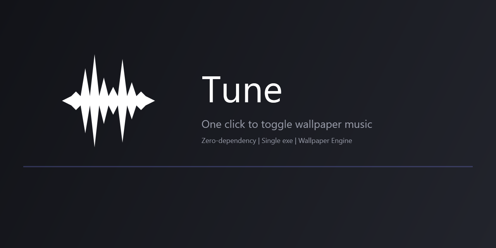

<div align="center">

# 🎵 Tune


[](LICENSE)
[](https://github.com/huaxiren6/Tune)
[](https://github.com/huaxiren6/Tune/releases)




**Tune — 点击屏幕固定区域，一键开关 Wallpaper Engine 壁纸背景音乐**

零依赖 · 单 exe · 开机自启 · 音乐渐变开关

[English](README.en.md) · 简体中文

</div>

## ✨ 功能

- **点击屏幕固定区域**（默认 1855, 755 ±50px）→ 切换壁纸音乐静音/取消静音
- **托盘图标双击** → 切换音乐
- **托盘图标右键** → 深色圆角菜单（开启音乐 / 退出）
- **音乐渐变**：约 0.6 秒慢慢停/慢慢开，点击瞬间图标和提示立即切换
- **托盘图标状态**：波形样式，不静音白色 / 静音红色
- **操作提示**：右下角深色圆角气泡，绿点=开启 / 红点=关闭 / 黄点=未检测到
- **开机自启**：注册后登录自动运行

只静音壁纸的声音，**壁纸动画照常运行**，其他应用声音不受影响。

## 📦 快速开始

1. 下载 [最新 Release](https://github.com/) 的 `we-music-ctl.exe`，放到任意目录
2. 双击运行，托盘出现白色波形图标
3. **校准点击区域**：命令行运行 `we-music-ctl.exe --pick`，屏幕中央出现提示框，点击你想要的位置即可
4. 点击屏幕那个位置、双击托盘图标，切换壁纸音乐

> 程序默认点击区域是 `(1855, 755)`。用 `--pick` 校准到你自己的屏幕。

## 🎯 操作方式

| 操作 | 效果 |
|---|---|
| 点击屏幕触发区域 | 切换音乐 |
| 托盘图标双击 | 切换音乐 |
| 托盘图标右键 | 深色圆角菜单 |
| 菜单「开启音乐」 | 切换音乐 |
| 菜单「退出」 | 退出程序（自动恢复音乐） |

## 🛠 命令行

```
we-music-ctl --status     # 显示 muted / unmuted / not-found
we-music-ctl --toggle     # 切换（同步渐变）
we-music-ctl --mute       # 静音
we-music-ctl --unmute     # 取消静音
we-music-ctl --pick       # 交互式校准触发区域
we-music-ctl --list       # 列出默认设备所有音频会话（调试）
we-music-ctl --identify   # 逐个静音活跃会话 2 秒，定位壁纸音乐（校准启发式）
```

## 🔧 从源码构建

需要：Windows + [.NET Framework 4.x](https://dotnet.microsoft.com/download/dotnet-framework)（Win10/11 自带）+ Git Bash

```bash
cd we-music-ctl
MSYS_NO_PATHCONV=1 bash build.sh
# 生成 we-music-ctl.exe
```

源码为 C# 5，使用系统自带 `csc.exe`，**零第三方依赖**。

## 🧠 识别原理

Windows 音频会话可通过 `ISimpleAudioVolume` 静音。部分环境（如本机）会话对象拿不到进程 ID（不支持 `IAudioSessionControl2`），因此采用**分组启发式**：

- 壁纸进程的多个音频流共享同一个 `GetGroupingParam` 分组
- 识别「分组内活跃会话数 ≥ 2」的分组作为壁纸音频，只操作**活跃**会话
- 识别不到时**回退**为切换所有「正在播放且非系统声音」的会话，保证开关始终可用

如果你在别的环境遇到识别问题，运行 `we-music-ctl.exe --identify` 校准。

## 📄 开源协议

[MIT](LICENSE) © 2026 we-music-ctl contributors

## 🙏 致谢

- 托盘图标来自 [Material Design Icons](https://github.com/Templarian/MaterialDesign)（`mdi:waveform`），Apache 2.0
